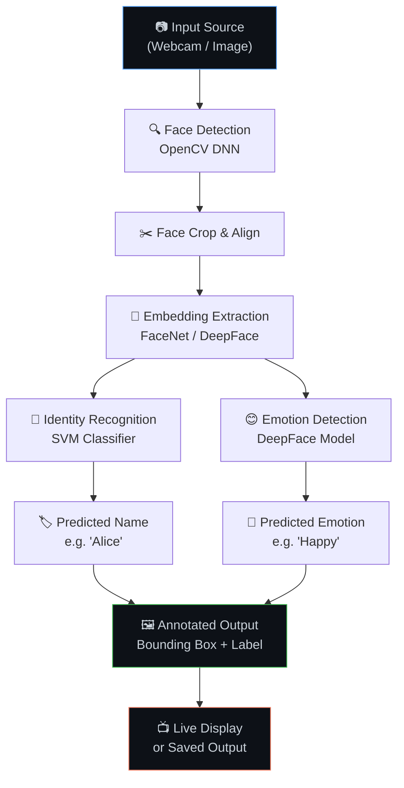

<div align="center">

# 🧠 Facial Recognition & Emotion Detection System

<p align="center">
  
  
  
  
  
  
</p>

<p align="center">
  <b>A real-time AI pipeline that detects faces, recognizes identities, and classifies human emotions — all from a single webcam frame.</b>
</p>

<br/>

</div>

---

## 📌 Table of Contents

- [Overview](#-overview)
- [Features](#-features)
- [System Architecture](#-system-architecture)
- [How It Works](#-how-it-works)
- [Tech Stack](#-tech-stack)
- [Project Structure](#-project-structure)
- [Installation](#-installation)
- [Usage](#-usage)
- [Future Improvements](#-future-improvements)
- [Contributing](#-contributing)
- [Author](#-author)
- [License](#-license)

---

## 🔍 Overview

The **Face Recognition & Emotion Detection System** is a modular, real-time AI application that fuses two powerful computer vision capabilities into a single seamless pipeline:

1. **Identity Recognition** — Identifies individuals in a frame using FaceNet embeddings + SVM classification.
2. **Emotion Detection** — Predicts facial expressions (happy, sad, angry, neutral, etc.) using DeepFace.

The output is a live annotated video stream where each detected face is labeled with the person's **name** and their current **emotional state** — rendered directly on the bounding box.

This system is designed for modularity and extensibility — whether you're building a smart attendance system, behavioral analytics tool, or a real-time surveillance application.

---

## ✨ Features

| Feature | Description |
|---|---|
| 🎯 **Real-Time Face Detection** | Processes live webcam feed and static images using OpenCV's DNN module |
| 🧬 **FaceNet Embeddings** | Extracts high-dimensional facial embeddings for precise identity matching |
| 🤖 **DeepFace Integration** | Leverages DeepFace's pre-trained models for fast and accurate emotion inference |
| 🏷️ **SVM Classifier** | Lightweight, fast identity classification with scikit-learn's SVM pipeline |
| 😄 **7-Class Emotion Detection** | Classifies: `Happy` · `Sad` · `Angry` · `Surprised` · `Fearful` · `Disgusted` · `Neutral` |
| 📦 **Modular Pipeline** | Clean separation between training, inference, and utility layers |
| 💾 **Persistent Model Storage** | Trained models saved and hot-loaded for zero-startup-delay inference |
| 🔌 **Extensible Architecture** | Drop-in support for new identities, datasets, and model backends |

---

## 🏗️ System Architecture



---

## ⚙️ How It Works

### Stage 1 — Face Detection
Every incoming frame is passed through **OpenCV's DNN-based face detector**, which returns bounding boxes around each detected face with a confidence score.

### Stage 2 — Embedding Extraction
The cropped face region is pre-processed and fed through **FaceNet** (or DeepFace's embedding model) to generate a compact 128-dimensional (or 512-dimensional) feature vector — a unique mathematical fingerprint of the face.

### Stage 3 — Identity Classification
The embedding vector is passed to a trained **SVM classifier** (with RBF kernel) that maps it to a known identity label (e.g., `"John"`) or flags it as `Unknown` when confidence is below threshold.

### Stage 4 — Emotion Detection
In parallel, the same face crop is analyzed by **DeepFace** using its pre-trained emotion model (fine-tuned on FER-2013 dataset), returning a probability distribution across 7 emotion classes.

### Stage 5 — Annotated Rendering
The predicted **name** and **dominant emotion** are overlaid onto the original frame as labeled bounding boxes and displayed or written to an output stream.

---

## 🛠️ Tech Stack

<div align="center">

| Layer | Technology |
|---|---|
| **Language** | Python 3.8+ |
| **Deep Learning** | TensorFlow 2.x, Keras |
| **Face Analysis** | DeepFace, FaceNet |
| **Computer Vision** | OpenCV 4.x |
| **ML Classification** | Scikit-learn (SVM, Pipeline) |
| **Data Processing** | NumPy, Pandas |
| **Visualization** | Matplotlib, OpenCV rendering |
| **Environment** | venv / conda |

</div>

---

## 📁 Project Structure

```
face-recognition-emotion-detection/
│
├── app/                          # 🚀 Core application package
│   ├── models/                   # 🧠 Model loading & management
│   │   ├── __init__.py
│   │   └── load_models.py        # Loads FaceNet, DeepFace & SVM models
│   │
│   ├── services/                 # ⚙️ Business logic / inference services
│   │   ├── __init__.py
│   │   ├── emotion_service.py    # Emotion detection logic (DeepFace)
│   │   └── face_service.py       # Face detection & recognition logic
│   │
│   ├── utils/                    # 🧰 Shared utility helpers
│   │   └── __init__.py           # Utility functions (drawing, preprocessing)
│   │
│   └── main.py                   # 🎬 Entry point — webcam / image inference
│
├── pipelines/                    # 🔄 Offline training pipelines
│   ├── __init__.py
│   ├── train_emotion.py          # Emotion model fine-tuning pipeline
│   └── train_face.py             # Face embedding extraction & SVM training
│
├── .gitignore                    # 🚫 Ignores models/, data/, __pycache__/
├── README.md                     # 📖 Project documentation
└── requirements.txt              # 📦 Python dependencies
```

---

## 🚀 Installation

### Prerequisites

- Python **3.8+**
- A working webcam (for real-time mode)
- Git

### Step 1 — Clone the Repository

```bash
git clone https://github.com/your-username/face-recognition-emotion-detection.git
cd face-recognition-emotion-detection
```

### Step 2 — Create & Activate Virtual Environment

```bash
# Create virtual environment
python -m venv venv

# Activate (Linux/macOS)
source venv/bin/activate

# Activate (Windows)
venv\Scripts\activate
```

### Step 3 — Install Dependencies

```bash
pip install -r requirements.txt
```

### Step 4 — Prepare Training Data

Organize your face images inside the `data/` Directory:

```
data/
├── Alice/
│   ├── alice_1.jpg
│   └── alice_2.jpg
└── Bob/
    ├── bob_1.jpg
    └── bob_2.jpg
```

> 💡 **Tip:** 15–30 varied images per person (different angles, lighting) yields the best recognition accuracy.

---

## 🎮 Usage

### Train the Face Recognition Model

```bash
python pipelines/train_face.py
```

This will:
- Extract FaceNet embeddings from all images in `data/`
- Train an SVM classifier on the embeddings
- Save model artifacts (auto-loaded at runtime via `app/models/load_models.py`)

### Train the Emotion Model

```bash
python pipelines/train_emotion.py
```

This will:
- Prepare or fine-tune the emotion detection model on your dataset
- Save trained weights for use by `app/services/emotion_service.py`

### Run Real-Time Webcam Inference

```bash
python app/main.py --mode webcam
```

### Run Inference on a Static Image

```bash
python app/main.py --mode image --input path/to/your/image.jpg
```

### Configuration

Key parameters can be tuned inside the relevant service files:

| File | What to Configure |
|---|---|
| `app/models/load_models.py` | Model paths, embedding backend (`Facenet`, `VGG-Face`, `ArcFace`) |
| `app/services/face_service.py` | Detection confidence threshold, Unknown identity threshold |
| `app/services/emotion_service.py` | Emotion backend, minimum face size for analysis |
| `app/main.py` | Input source (webcam index or image path), display FPS toggle |

---

## 🔭 Future Improvements

- [ ] **GPU Acceleration** — CUDA/TensorRT optimization for edge deployment
- [ ] **REST API** — FastAPI wrapper for remote face recognition endpoints
- [ ] **Anti-Spoofing** — Liveness detection to prevent photo attacks
- [ ] **Multi-Camera Support** — Simultaneous inference across camera streams
- [ ] **Attendance System Module** — Auto-log recognized individuals with timestamps
- [ ] **FAISS Vector Search** — Replace SVM with approximate nearest-neighbor search for large-scale identity databases
- [ ] **Age & Gender Estimation** — Additional demographic attribute prediction
- [ ] **Docker Container** — Fully containerized deployment with Docker Compose

---

## 🤝 Contributing

Contributions are welcome and appreciated! Here's how to get started:

```bash
# 1. Fork the repository
# 2. Create your feature branch
git checkout -b feature/your-feature-name

# 3. Commit your changes
git commit -m "feat: add your feature description"

# 4. Push to your branch
git push origin feature/your-feature-name

# 5. Open a Pull Request
```

Please follow the existing code style and include tests for any new functionality.

---

## 👤 Author

<div align="center">

**Your Name**

[](https://github.com/AastikDaryal1)
[](https://linkedin.com/in/your-profile)

</div>

---

## 📄 License

This project is licensed under the **MIT License** — see the [LICENSE](LICENSE) file for full details.

```
MIT License © 2024 Your Name
Permission is hereby granted, free of charge, to any person obtaining a copy
of this software and associated documentation files, to deal in the Software
without restriction...
```

---

<div align="center">

⭐ **If this project helped you, consider giving it a star!** ⭐

<br/>


&nbsp;


</div>
